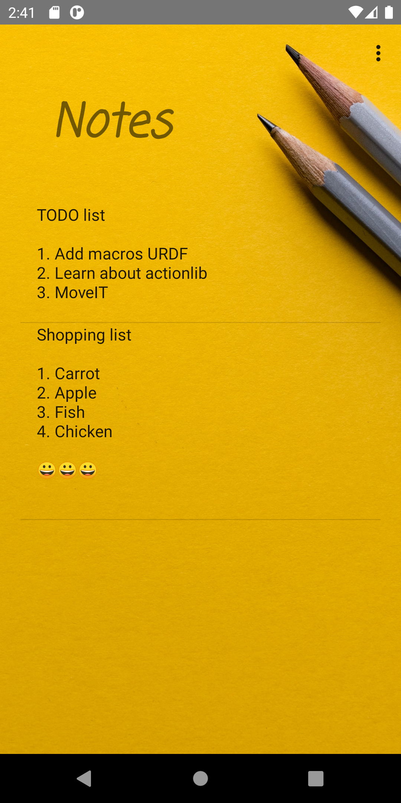
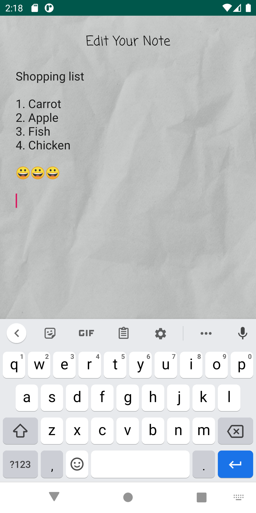
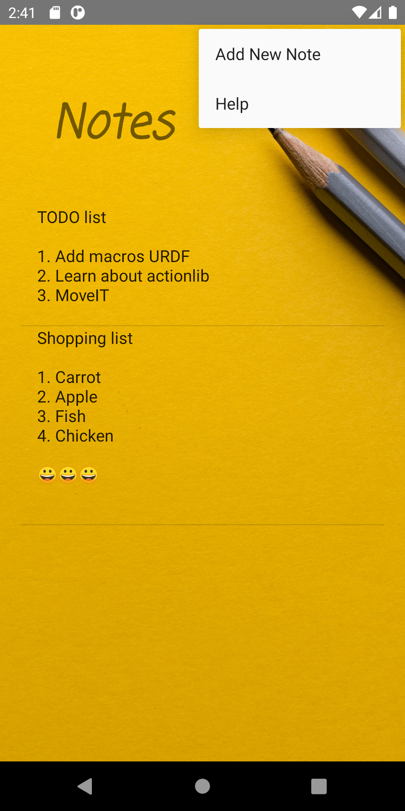

# android_notes
Hello!!. This is a simple android notes app. You can add notes, change them and delete them. I used a list view(already deprecated but easy to use)
to store notes. Long press on a note to delete it.

You can use this to learn about, 
 - How to use multiple activities.
 - How to use ActionBar menu items. 
 - How to store the data to the memory and read them back
 - How to pass data between activities using intent extras
 - How to use dialog boxes
 
Feel free to change this app and use it in your own applications.
 
Thank you!!
 
I used two photos from [unsplash](https://unsplash.com/)
 - MainActivity image by [Joanna Kosinska](https://unsplash.com/@joannakosinska?utm_source=unsplash&utm_medium=referral&utm_content=creditCopyText)
 - EditActivity image by [Марьян Блан | @marjanblan](https://unsplash.com/@marjan_blan?utm_source=unsplash&utm_medium=referral&utm_content=creditCopyText)

## MainActivity View

## Edit Note View

## Using Menu Items

## Delete note dialog box

[Oreo Development Course](https://www.udemy.com/share/101Y5MAkMcdl5bRXo=/)
